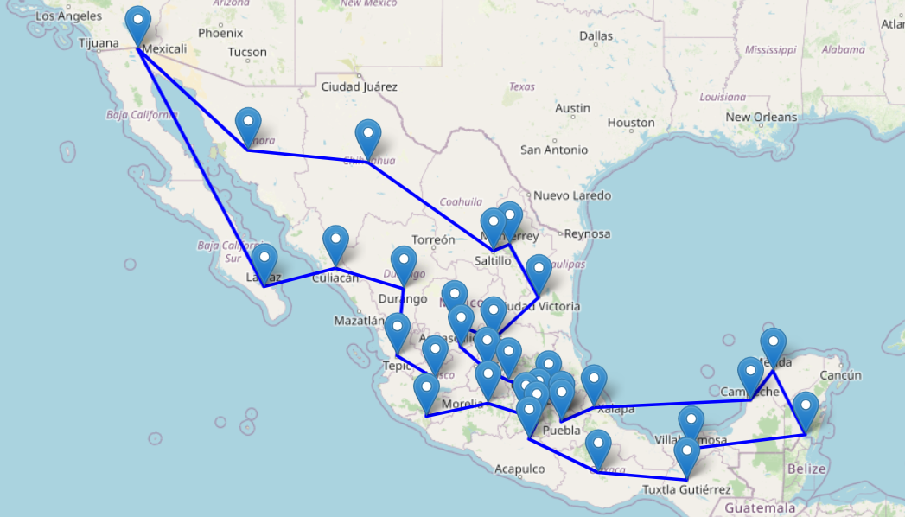
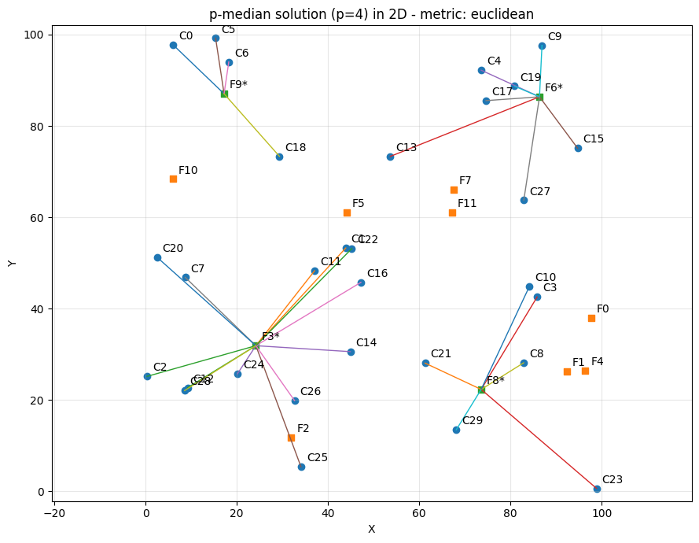
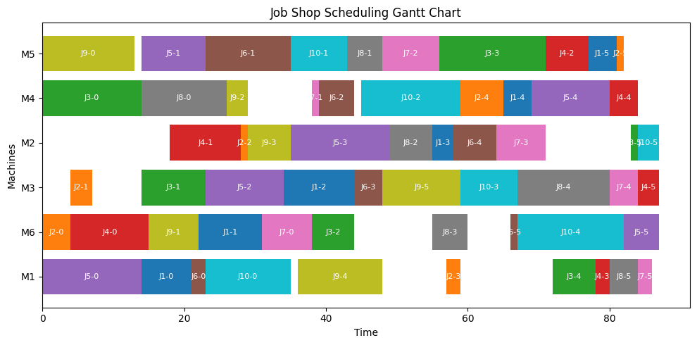

# IN2009B Optimization Course Material

This repository contains Jupyter notebooks and supporting material for the **IN2009B course at Tecnológico de Monterrey**. It combines mathematical optimization models written in **AMPL** with **Python/amplpy** for data generation, solution extraction, and visualization. HiGHS is the default solver; Gurobi is optional. Topics include location, production planning, routing, and scheduling.

The material is designed for **teaching and learning purposes**, combining mathematical formulations, modeling insights, and computational examples that help students understand how optimization models are formulated and how they can be **approached in practice** (yes I know that not all the cases MIP formulations are the best, this is for learning purposes).

<p align="center">
  
</p>

---

## Course contents

The repository is organized into three main modules:

### 1. Location
This module introduces classical location models used in operations research and supply chain design.

Topics include:
- P-median
- P-center
- P-dispersion
- Uncapacitated Facility Location Problem (UFLP)
- Capacitated Facility Location Problem (CFLP)
- Stronger formulations for CFLP

<p align="center">
  
</p>

### 2. Production and Capacity
This module covers selected optimization models related to production planning and capacity decisions.

Topics include:
- Dynamic lot-sizing
- Flexibility design problem

### 3. Routing and Scheduling
This module presents representative routing and scheduling problems, together with different modeling approaches and computational tools.

Topics include:
- Traveling Salesman Problem (TSP)
- Efficient TSP formulations (DFJ cuts with an integer cutting-plane loop)
- Vehicle Routing Problem (VRP)
- Capacitated Vehicle Routing Problem (CVRP)
- CVRP with PyVRP
- Job Shop Scheduling

<p align="center">
  
</p>

---

## Repository structure

The organization of the repository is as follows:

```text
IN2009B-course/
├── README.md
├── requirements.txt
├── Intro/
│   ├── Intro_Welcome.pptx
│   └── Intro.ipynb
├── notebooks/
│   ├── Location/                 # 1–6
│   ├── Production and Capacity/  # 7–8
│   └── Routing-Scheduling/       # 9–14
├── Images/
└── tests/
    └── validate_notebooks.py


```
## Module overview

| Module                  | Main topics                                                                      | Format                  |
| ----------------------- | -------------------------------------------------------------------------------- | ----------------------- |
| Introduction            | Course presentation and mathematical programming review in AMPL/Python           | Presentation + notebook |
| Location                | P-median, P-center, P-dispersion, UFLP, CFLP, stronger CFLP formulations         | Jupyter notebooks       |
| Production and Capacity | Dynamic lot-sizing, flexibility design                                           | Jupyter notebooks       |
| Routing and Scheduling  | TSP, DFJ cutting planes, VRP, CVRP, CVRP with PyVRP, job shop scheduling            | Jupyter notebooks       |

## How to use this repository

This repository is intended to be used as course support material. Students are encouraged to:

* Review the notebooks in the suggested order.
* Read the explanations and mathematical formulations included in each notebook.
* Execute the code cells step by step.
* Modify parameters and data to better understand the behavior of the models.
* Use the notebooks as a basis for experimentation and discussion in class.

## Google Colab environment

The notebooks in this repository are primarily designed to be run in Google Colab. This makes the material easier to use in class and reduces the need for local setup.

Using Google Colab allows students to:

* Run notebooks directly from the browser.
* Avoid many local installation issues.
* Execute Python code in a preconfigured environment.
* Share notebook-based material easily.

Although the notebooks are intended for Colab, they can also be executed in a local Jupyter environment if the required packages are installed.

## Software considerations

### AMPL, amplpy, and solver selection

Fourteen notebooks use `amplpy` and visible AMPL declarations (`model.eval(...)`). There is no `gurobipy` dependency in those notebooks. Each notebook is standalone: run its installation/setup cell first, then the remaining cells in order.

```python
SOLVER = "highs"        # Default; open-source LP/MIP solver
LICENSE_UUID = "default"  # AMPL Community Edition on Google Colab
```

On Colab, `ampl_notebook(modules=[SOLVER], license_uuid=LICENSE_UUID)` installs the AMPL runtime and solver module and uses the default Community Edition license. AMPL itself is licensed software: an open-source solver does not remove the need for an AMPL license. Outside Colab, obtain a free [AMPL Community Edition license](https://ampl.com/ce) and use its UUID, or use your existing valid AMPL license. Without an unlimited license, the demo runtime has size limits and the larger course examples may not run.

For local Jupyter:

```bash
python -m pip install -r requirements.txt
python -m amplpy.modules install highs
python -m amplpy.modules activate <your-community-edition-uuid>
```

To use Gurobi, set `SOLVER = "gurobi"` **before rerunning the setup cell** and provide an AMPL-compatible license with Gurobi access (for example, an AMPL for Courses license). A `gurobipy` license alone should not be assumed to authorize the AMPL driver. See [AMPL Python setup and licensing](https://amplpy.ampl.com/).

`solve_checked` refuses to extract results unless optimality has been established. AMPL variable values are materialized as numeric dictionaries, which are used by the existing plots. Run the model/extraction cell again after changing data; dictionaries are snapshots, not live solver objects.

### TSP subtour separation

Notebook 10 replaces the Gurobi-specific lazy-constraint callback with a solver-independent **integer cutting-plane loop**. It solves the degree model to optimality, separates disconnected components, adds DFJ cuts through AMPL, and repeats. This is **not an in-tree branch-and-cut implementation**. The final connected optimal candidate proves TSP optimality; each added cut is valid for every Hamiltonian tour. The loop may take longer than a native callback implementation because it restarts the MIP search.

### Other libraries

Notebook 13 still uses **PyVRP** as a heuristic routing alternative and is unchanged. The introduction retains **GILP** for simplex visualization. NumPy, Matplotlib, NetworkX, and Folium remain responsible for data and plots; switching the mathematical-programming solver does not affect these roles.

### Validation

```bash
# Check all migrated notebook schemas, Python code, and removed API dependencies
python tests/validate_notebooks.py

# Solve all migrated model/plotting paths on reduced smoke fixtures
python tests/validate_notebooks.py --execute

# Optional AMPL/Gurobi driver validation (requires that module/license)
python tests/validate_notebooks.py --execute --solver gurobi

# Optional regression against the original Gurobi notebooks
# Requires gurobipy and a valid license; choose a pre-migration ref explicitly
python tests/validate_notebooks.py --execute --compare-ref <pre-migration-commit>

# Keep the full-sized notebook examples (requires a suitable AMPL license)
python tests/validate_notebooks.py --execute --full
```

Smoke tests preserve the small examples and reduce only the larger dispersion, TSP, VRP, CVRP, and random job-shop examples to fit a demo license. They check objective equivalence against the selected original revision when `--compare-ref` is supplied, AMPL constraint feasibility, route coverage/capacity, TSP connectivity, and job-shop precedence/non-overlap. Extra tests cover unused CVRP vehicles and refusal to extract an infeasible solution. Solver tie-breaking may give different optimal routes or facility selections at the same objective value. Installation cells are deliberately not executed by the test runner: configure the environment first.

If you start a new repository from the ZIP, `python tests/validate_notebooks.py --execute` works without Git history. The optional `--compare-ref` regression requires the original pre-migration history to be available locally; it is not included in the ZIP.

## Intended audience

This material is mainly intended for:

* Students enrolled in the IN2009B course at Tecnológico de Monterrey.
* Students (bachelor degree) interested in optimization modeling with Python.

## Author

José Emmanuel Gómez Rocha

Tecnológico de Monterrey
